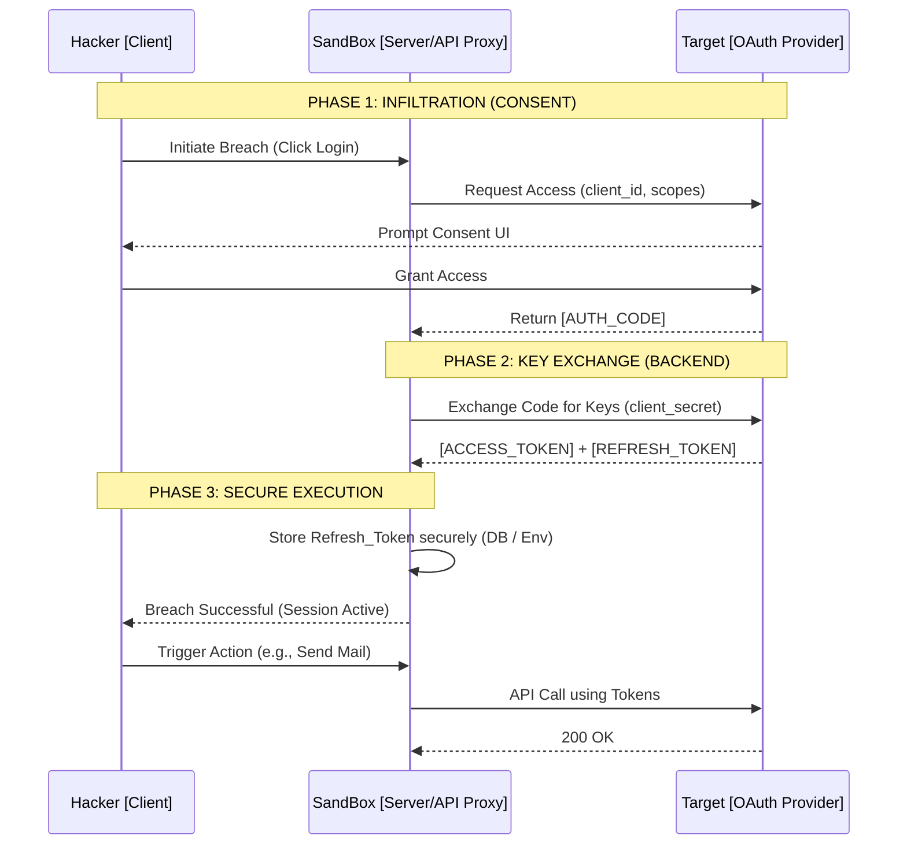

<div align="center">

```text
  _________    _   ______  ____  ____  _  __
 / ___/ _ |  / | / / __ \/ __ )/ __ \| |/ /
 \__ \/ __ | /  |/ / / / / __  / / / /   / 
___/ / ___ |/ /|  / /_/ / /_/ / /_/ /   |  
/____/_/ |_/_/ |_/_____/_____/\____/_/|_|  
                                           
> INIT SEQUENCE: 100%
> ACCESS LEVEL: ROOT
> ENCRYPTION: SHA-256 (VERIFIED)
> SYSTEM STATUS: ONLINE
```

### [ / Advanced Educational Auth Hub & API Validator / ]

<br>
<i>"Amateurs hack systems. Professionals hack human error. Master the architecture, and you master the network."</i>
<br><br>

</div>

---

## ⚡ [SYSTEM_OVERVIEW]

`SANDBOX` is an elite, high-fidelity training matrix designed to demystify the core pillars of modern web security. Forget sterile documentation—this is a live-fire environment for mastering **OAuth2 Handshakes**, **Token Lifecycles**, and **Secure API Proxies**. 

Built with a cyberpunk-inspired, terminal-grade aesthetic, it provides developers with the tools to safely test, validate, and understand secure integrations without exposing credentials to the client network.

The system is engineered as a zero-trust playground. Every external call, every key validation, and every email dispatch is routed through server-side proxies to demonstrate production-ready security patterns.

<br>

## 🧠 [CORE_DIRECTIVES_&_PEDAGOGY]

Why does `SANDBOX` exist? 

In the modern web ecosystem, exposing an API key or a Client Secret in a frontend bundle is a critical vulnerability. This project is built specifically to educate developers on *why* this happens and *how* to prevent it.

**Learning Objectives:**
1. **The Handshake**: Understanding the flow from Authorization Code `->` Access Token `->` Refresh Token.
2. **Server-Side Proxying**: Learning to use Next.js Route Handlers (`/api/...`) to hide secrets from the browser's Network Tab.
3. **Scope Management**: Visualizing what permissions a token actually holds (e.g., GitHub PAT scopes).
4. **Token Decay**: Understanding the ephemeral nature of Access Tokens and the persistence of Refresh Tokens.

<br>

## 🕸️ [ARCHITECTURE_GRAPH & OAUTH2 PROTOCOL]

The following schematic details the secure handshake protocol utilized within the SANDBOX environment. This architecture ensures that sensitive keys (`client_secret`, `refresh_token`) never touch the browser DOM.



<br>

## 🛡️ [THREAT_MODEL_ANALYSIS]

`SANDBOX` actively mitigates the following attack vectors to demonstrate best practices:

*   **Credential Leakage via Client Bundle**: By moving all API calls (Groq, GitHub, Google) to Next.js API routes, no keys are ever shipped to the user's browser.
*   **Token Interception**: All OAuth callbacks are handled server-side.
*   **Scope Creep**: The GitHub validator specifically parses `x-oauth-scopes` headers to show exactly what a token is allowed to do, emphasizing the principle of least privilege.

<br>

## 📂 [SYSTEM_MODULES_DEEP_DIVE]

The application is split into 6 distinct tactical sectors, accessible via the top-right swatch navigation.

### `[01]` SETUP (Core Configuration)
The nerve center. This module validates your current environment. It checks if your `.env` file is armed with the correct Google Client IDs and Secrets. Without this, the infiltration cannot begin.

### `[02]` LOGIN (The Infiltration)
A live visualization of the OAuth2 URL construction. It breaks down the `response_type`, `client_id`, `redirect_uri`, and `scope` parameters before you execute the redirect to Google's consent screen.

### `[03]` DASHBOARD (Command Center)
Real-time token health monitoring. Once the handshake is complete, this page dissects the returned payload, showing the Access Token, Expiry, and the highly coveted Refresh Token.

### `[04]` EMAIL (Payload Delivery)
Demonstrates automated server-to-server communication. Using `nodemailer` and `googleapis`, this module uses your stored Refresh Token to generate a fresh Access Token and dispatch an email *without* user interaction.

### `[05]` VALIDATOR (API Key Interrogation)
A secure proxy dashboard to validate static API keys. 
- **Groq Validator**: Executes a minimal Llama 3 inference to verify key authenticity.
- **GitHub PAT Checker**: Interrogates the GitHub API to extract the exact permissions bound to a Personal Access Token.

### `[06]` ADVANCED (Security Diagnostics)
Placeholder for future deep-dive tools, such as token revocation testing, JWT decoding, and payload spoofing simulations.

<br>

## 🔐 [LOGIN_DATA & SECRETS_MANAGEMENT]

To operate this node, you must supply the necessary encrypted environment variables. 
Create a `.env` file at the root directory with the following payloads:

```bash
# [GOOGLE_OAUTH_CREDENTIALS]
# Obtain these from the Google Cloud Console (APIs & Services -> Credentials)
GOOGLE_CLIENT_ID="your_client_id.apps.googleusercontent.com"
GOOGLE_CLIENT_SECRET="your_client_secret_hash"
GOOGLE_REDIRECT_URI="http://localhost:3000/api/auth/callback/google"

# [TARGET_TOKENS]
# This is generated AFTER your first successful login handshake.
GOOGLE_REFRESH_TOKEN="your_long_lived_refresh_token"

# [VALIDATOR_KEYS] (Optional for testing the Validator module)
GROQ_API_KEY="gsk_..."
GITHUB_PAT="ghp_..."
```

> **CRITICAL WARNING:** The `GOOGLE_REFRESH_TOKEN` is your master key. Treat it like a password. Once obtained via the Dashboard, inject it into your `.env` to enable background automation tasks. Never commit your `.env` file to version control.

<br>

## 📡 [API_PROXY_ROUTING_MAP]

`SANDBOX` utilizes backend routes to mask operations from the client.

| Route Endpoint | Method | Purpose | Security Posture |
| :--- | :--- | :--- | :--- |
| `/api/validate/groq` | `POST` | Proxies chat completion requests to Groq. | Hides `GROQ_API_KEY`. |
| `/api/validate/github` | `POST` | Interrogates GitHub user endpoint. | Parses `x-oauth-scopes` securely. |
| `/api/send-email` | `POST` | Dispatches emails via Nodemailer + OAuth. | Uses server-stored Refresh Token. |

<br>

## 🧬 [TECH_STACK_MATRIX]

> `SYS_VARS: [ "Next.js", "React", "TypeScript", "Tailwind CSS", "Framer Motion", "Node.js" ]`

- **Frontend Engine**: Next.js 14+ (App Router) & React 18
- **Styling Architecture**: Tailwind CSS with custom neon hex codes (`#EEFF00`, `#4D3CFF`) and glassmorphism techniques.
- **Animation Physics**: Framer Motion (Driving the infinite ECG heart rate SVGs and layout transitions).
- **Typing Strictness**: TypeScript (Enforcing strict payload interfaces).
- **Auth Protocols**: Google APIs (`googleapis`), NextAuth.
- **Transport Layer**: Nodemailer (Automated payloads).

<br>

## 🚀 [BOOT_SEQUENCE]

Execute the following commands to initialize the local server node:

```bash
# 1. Clone the repository
git clone https://github.com/ChitkulLakshya/SandBox.git

# 2. Access the directory
cd SandBox

# 3. Install dependencies
npm install

# 4. Ignite the server (Development Mode)
npm run dev

# 5. Build for Production Deploy
npm run build
npm start
```

Target your local browser to `http://localhost:3000` to interface with the Matrix.

<br>

## 🔮 [FUTURE_EXPANSION_PROTOCOLS]

This sandbox is a living, breathing environment. Planned architectural upgrades include:

- `[ ]` **Persistent Database Integration**: Moving from `.env` based refresh tokens to a Postgres (Supabase/Prisma) managed multi-tenant system.
- `[ ]` **JWT Decryptor**: A visual tool to decode and verify JSON Web Token signatures in real-time.
- `[ ]` **Webhook Listener**: A dedicated route to catch and log incoming webhooks from external services (Stripe, GitHub) for payload analysis.
- `[ ]` **Rate Limit Simulation**: Intentional 429 triggering to teach exponential backoff strategies.

<br>

## 🛠️ [SYSTEM_DIAGNOSTICS & TROUBLESHOOTING]

*   **Error 401 Unauthorized (Google)**: Your Access Token has likely decayed. Ensure your `GOOGLE_REFRESH_TOKEN` is correctly set in the `.env` to allow the system to silently fetch a new one.
*   **Redirect URI Mismatch**: Ensure `http://localhost:3000/api/auth/callback/google` is explicitly whitelisted in your Google Cloud Console OAuth 2.0 Client ID settings.
*   **Groq Validation Fails**: Double-check that your `GROQ_API_KEY` is valid and hasn't hit its rate limits.

---
<div align="center">
  <i>"End of Line."</i>
</div>
