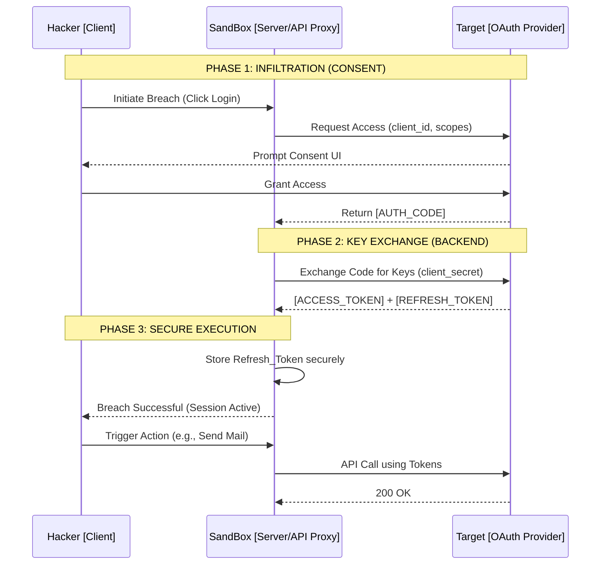

<div align="center">

```text
  _________    _   ______  ____  ____  _  __
 / ___/ _ |  / | / / __ \/ __ )/ __ \| |/ /
 \__ \/ __ | /  |/ / / / / __  / / / /   / 
___/ / ___ |/ /|  / /_/ / /_/ / /_/ /   |  
/____/_/ |_/_/ |_/_____/_____/\____/_/|_|  
                                           
> INIT SEQUENCE: 100%
> ACCESS LEVEL: ROOT
> SYSTEM STATUS: ONLINE
```

### [ / Advanced Educational Auth Hub & API Validator / ]

</div>

---

## ⚡ [SYSTEM_OVERVIEW]

`SANDBOX` is an elite, high-fidelity training matrix designed to demystify the core pillars of modern web security. Forget sterile documentation—this is a live-fire environment for mastering **OAuth2 Handshakes**, **Token Lifecycles**, and **Secure API Proxies**. 

Built with a cyberpunk-inspired, terminal-grade aesthetic, it provides developers with the tools to safely test, validate, and understand secure integrations without exposing credentials to the client.

<br>

## 🧬 [TECH_STACK]

> `SYS_VARS: [ "Next.js", "React", "TypeScript", "Tailwind CSS", "Framer Motion", "Node.js" ]`

- **Frontend Core**: Next.js 14+ (App Router) & React
- **Styling Engine**: Tailwind CSS (Custom Dark/Neon Tokens)
- **Animation Matrix**: Framer Motion (Infinite SVGs, Layout Transitions)
- **Typing Strictness**: TypeScript
- **Auth Protocols**: Google APIs (`googleapis`), NextAuth (Custom implementation)
- **Transport**: Nodemailer (Automated payloads)

<br>

## 🕸️ [ARCHITECTURE_GRAPH]

The following schematic details the secure handshake protocol utilized within the SANDBOX environment. This architecture ensures that sensitive keys (`client_secret`, `refresh_token`) never touch the browser DOM.



<br>

## 🔐 [LOGIN_DATA & SECRETS_MANAGEMENT]

To operate this node, you must supply the necessary encrypted environment variables. 
Create a `.env` file at the root directory with the following payloads:

```bash
# [GOOGLE_OAUTH_CREDENTIALS]
GOOGLE_CLIENT_ID="your_client_id.apps.googleusercontent.com"
GOOGLE_CLIENT_SECRET="your_client_secret_hash"
GOOGLE_REDIRECT_URI="http://localhost:3000/api/auth/callback/google"

# [TARGET_TOKENS]
GOOGLE_REFRESH_TOKEN="your_long_lived_refresh_token"

# [VALIDATOR_KEYS] (Optional for testing)
GROQ_API_KEY="gsk_..."
GITHUB_PAT="ghp_..."
```

> **WARNING:** The `GOOGLE_REFRESH_TOKEN` is your master key. Once obtained via the Setup module, inject it into your `.env` to enable background automation tasks (like the automated Gmail sender) without requiring the user to be present.

<br>

## 🚀 [BOOT_SEQUENCE]

Execute the following commands to initialize the local server node:

```bash
# 1. Clone the repository
git clone https://github.com/ChitkulLakshya/SandBox.git

# 2. Access the directory
cd SandBox

# 3. Install dependencies
npm install

# 4. Ignite the server
npm run dev
```

Target your local browser to `http://localhost:3000` to interface with the Matrix.

<br>

## 🛠️ [SYSTEM_MODULES]

*   **`[01]` Setup Core**: Environment variable validation and status checks.
*   **`[02]` Login Flow**: Live visualization of the OAuth2 URL construction and consent screen redirection.
*   **`[03]` Dashboard**: Real-time token health monitoring and extraction.
*   **`[04]` Email Automation**: Utilizing the `refresh_token` and `nodemailer` to trigger server-side API actions.
*   **`[05]` Universal Validator**: A secure proxy dashboard to validate static API keys (Groq, GitHub) without exposing them to the client's network tab.

---
<div align="center">
  <i>"Control your keys, control the network."</i>
</div>
